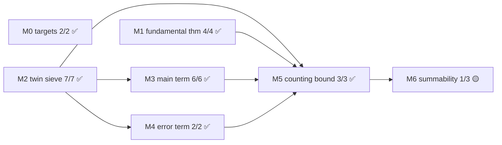
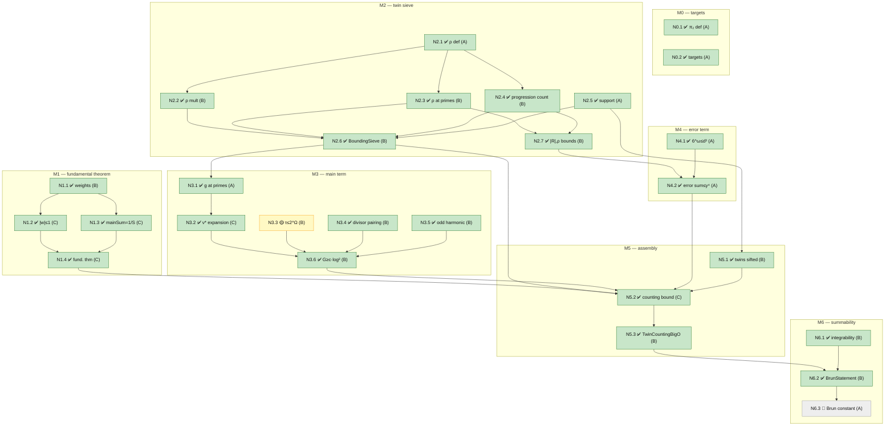

# Brun's theorem — reader's guide

<!--
MAINTENANCE RULES (contract; see CLAUDE.md workflow step 5 + iron rule 5)

Who may edit what:
  - All prose sections (§1-§5) and every card's **Statement.** / **Role.**
    field: Fable/human sessions ONLY. These are the immutable shadow of the
    blueprint statements (iron rule 1 applies to them).
  - Card volatile fields (**Proof idea. Lean. Status. Difficulty. Notes.**),
    Mermaid status classes/emoji, and the §0 frontier list: any tier, as
    part of landing or flagging a node (same commit as the proof — workflow
    step 5).
  - The §0 strategic line: Fable/human only.

Status tokens (used identically in cards, graphs, and the briefing):
  ✅ proved (sorry-free, axiom-audited)   🟡 partial (Status line says which part)
  🔴 open                                 ⛔ tier-blocked (attempted; see flags)
  🔬 research-keystone annotation (may combine with 🔴/⛔)

Card grammar (parsed by scripts/blueprint_lint.py — keep it exact):
  #### N<x>.<y> — <short name> <status token>
  **Statement.** <prose; immutable>
  **Role.** <prose; immutable>
  **Proof idea.** <actual if proved, "(expected)" if open>
  **Lean.** `fully.qualified.name` (file); ... | — not started
  **Status.** <token> <detail; date; tier, attempts>
  **Difficulty.** predicted <class>[, actual <assessment>]
  **Notes.** <optional>
  Open/blocked cards must cite NO backticked names in the Lean field.
  Lean-trench gotchas do NOT go in cards — they live in flags.md; link by date.

Green lint = "not mechanically stale", never "the prose is true".
Statement fidelity is guaranteed by the immutability rule above, not by tooling.
-->

## 0. Briefing

*Updated: 2026-07-07 (Fable).*

- **State**: **26 of 27 nodes proved. `BrunStatement` itself is proved**
  (N6.2, 2026-07-07) — the sum of reciprocals of twin primes converges,
  kernel-checked, standard axioms only. Only N6.3 (bonus) remains.
- **Frontier** (open, all deps met): **N6.3** (A) — define `brunConstant`
  as the series' value and prove positivity. Not a dependency of the
  track's goal; purely a quotability bonus.
- **Next step**: N6.3, then the track is fully closed (27/27).
- **Blockers**: none.
- **Strategic line**: **the track's objective is achieved.** `Salt.N6.N6_2
  : BrunStatement` is sorry-free and kernel-checked
  (`propext, Classical.choice, Quot.sound` only), independently verified
  three times including an explicit confirmation that `Salt/Brun.lean`'s
  definition of `BrunStatement` was never altered. Everything from N1
  through N6.2 was genuinely load-bearing — no step shortcut around the
  twin-prime density bound. N6.3 is the only remaining node, and it is
  ungated by anything upstream.

## 1. Big picture

**The project (salt).** A machine-checked proof of the Twin Prime Conjecture
is the aspirational objective (`TwinPrimeConjecture`, Salt/Basic.lean). Nobody
knows how to prove TPC; the project's honest form is a ladder of frontier
formalizations — sieve theory first, then (if the ladder holds) toward
Bombieri–Vinogradov and Maynard–Tao. Each rung is a real, self-contained
mathematical artifact.

**This track (Brun).** The first rung: **Brun's theorem** — the sum of
reciprocals of twin primes converges (`BrunStatement`), in pointed contrast
to mathlib's divergence of Σ 1/p over all primes. Per the 2026-07 survey in
the blueprint, **no completed formalization exists in any major proof
assistant** — Mellendijk's Lean 4 sieve repo names it as its end-goal but its
twin-prime file is a stub. Completing it is an announceable first.

**What "done" means.** A `theorem` of type `BrunStatement` with no `sorry`,
kernel-checked, whose axioms are exactly mathlib's standard three
(`propext`, `Classical.choice`, `Quot.sound`). The kernel is the referee;
this guide is only the map.

**The payoff en route.** Three mathlib-worthy pieces independent of Brun
itself: the ported Selberg fundamental theorem (M1), the Mertens-free
main-term bound (M3), and the congruence-counting module. Plus a dataset:
every node records predicted vs. actual difficulty across the model-tier
cascade — raw material for an experience report on LLM-driven formalization.

## 2. The route, and why this route

**Sifting twins.** Fix `N` and a threshold `z`. For `n ∈ [1, N]` form the
products `n(n+2)`. If `n > z` is a twin-prime leader (both `n` and `n+2`
prime), then `n(n+2)` has **no** prime factor `≤ z`. So the number of twin
leaders in `(z, N]` is at most the number of `n ∈ [1, N]` whose `n(n+2)`
survives sifting by every prime `≤ z` — the *sifted count* — and the twins
below `z` cost only `+z` to add back. Everything reduces to an upper bound
on the sifted count.

**The Selberg Λ² upper bound.** For any real weights `λ` supported on
divisors of `P = ∏ p ≤ z` with `λ₁ = 1`, the square
`(Σ_{d ∣ gcd(m, P)} λ_d)²` is `≥ 1` when `m` is coprime to `P` and `≥ 0`
always — so its sum over the support dominates the sifted count. Expanding
the square gives `(main coefficient)·N + remainder`, where the main
coefficient is a quadratic form in `λ`. Selberg's move: the form
diagonalizes over indices `ℓ ∣ P` and can be minimized exactly subject to
`λ₁ = 1`; truncating the support to `d² ≤ y` keeps the remainder sum finite.
The minimum is `1/S` where `S = Σ_{ℓ ∣ P, ℓ² ≤ y} g(ℓ)` — classically
written `G(√y)` with `G(t) = Σ_{ℓ ∣ P, ℓ < t} g(ℓ)`, and `S ≥ G(√y)` since
`g > 0`, so lower bounds for `G` transfer — with
`g(ℓ) = ∏_{p ∣ ℓ} ν(p)/(1 − ν(p))`. For twins the local density is
`ν(d) = ρ(d)/d`, with `ρ(d)` the number of roots of `n(n+2) ≡ 0 mod d`:
`ρ(2) = 1`, `ρ(p) = 2` for odd `p`. Net:

> π₂(N) ≤ N / S + Σ_{d ∣ P, d ≤ y} 3^ω(d) |R_d| + z + O(1).

**Design decision 1 — Mertens-free main term.** The classical lower bound
`G(z) ≫ (log z)²` goes through Mertens' theorems, and mathlib has none of
them (recon 2026-07: only qualitative divergence of Σ 1/p). Instead we go
through the divisor function: expanding each `(1 − ν(p))⁻¹` as a finite
geometric series and grouping integers by radical converts `G(z)` into
`Σ_{m < z odd} ν*(m)` with `ν*(∏p^a) = ∏ν(p)^a`; for odd `m` this is
`2^Ω(m)/m ≥ τ(m)/m`; and a bare-hands divisor pairing plus mathlib's
harmonic-number bounds give `Σ_{m<z, odd} τ(m)/m ≥ (Σ_{a<√z, odd} 1/a)²
≳ (log z)²` with explicit constants. The only analytic input is
`Mathlib/NumberTheory/Harmonic/`.

**Design decision 2 — crude error term.** The sharp bound on
`Σ_{d<y} 3^ω(d)|R_d|` uses divisor-sum asymptotics — also absent from
mathlib. But we need *any* power saving, not sharpness:
`|R_d| ≤ ρ(d) ≤ 2^ω(d)`, so each term is `≤ 6^ω(d) ≤ d³` for squarefree
`d`, and the whole sum is `≤ y⁴`. With `y = N^{1/5}` that is `N^{4/5}` —
negligible against `N/(log N)²`, with exponent slack to spare (any
`y = N^θ`, `θ < 1/4`, works).

**Endgame.** Abel summation (`summable_mul_of_bigO_atTop`, template
`Chebyshev.primeCounting_eq_theta_div_log_add_integral`) converts
`π₂(N) = O(N/(log N)²)` into convergence of `Σ 1/p`.

**Rejected routes.** (i) Mertens-based main term — upstreaming Mertens first
is a bigger project than the workaround. (ii) Sharp error via divisor
asymptotics — same. (iii) Brun's original pure sieve — avoids the Λ²
optimization entirely, but its truncated inclusion–exclusion is messier and
has no mathlib scaffolding; retained as fallback A2, not the mainline.

## 3. Risk register

**R1 — the Selberg optimization (N1.2–N1.4).** *RETIRED 2026-07-07.* The
entire fundamental theorem is ported and kernel-verified (N1.1–N1.4 in
`Salt/Brun/SelbergPort.lean`), so this is no longer a risk. Retained for the
record: mathlib's `SelbergSieve.lean` provided the Λ² bound, upper-Möbius
property, and diagonalization but not the optimal-weight choice or
`mainSum = 1/S`; those were ported from `amellendijk/selberg-sieve4`
(Mellendijk; Apache-2.0), whose `SieveLemmas.lean` *is* mathlib's upstreamed
foundation. The port went through in one delegated pass — the ~2.5-year API
drift (Lean v4.7.0-rc2 → v4.32.0-rc1) was entirely mechanical
(`∑ in`→`∈`, `₀`-cancel lemmas, notation scopes), `card_lcm_eq` was a direct
mathlib hit (`Nat.card_pair_lcm_eq`), and no upstream PR needed coordinating.
*Residual note for N5.2:* the theorems are stated for `s : SelbergSieve`,
but the N2.6 instance is a `BoundingSieve`; N5.2 must add a `level` to
upgrade it (see the N1.4 card and R4).

**R2 — the geometric expansion (N3.2).** *RETIRED 2026-07-07.* Proved
(`Salt/Brun/M3Expansion.lean`), so no longer a risk. It was the one C-node
with no template: the radical-grouping argument closed via a per-fiber
injection into the `Nat.factorization` exponent grid plus a per-prime
geometric partial-sum bound. Fallback A4 was not needed. The truncation
turned out cleaner than feared — `K = z` works directly because
`Nat.factorization_lt` bounds every exponent by `m < z`, so no `p^K ≥ z`
argument is required.

**R3 — mathlib API friction.** *Severity: low, chronic.* Pinned at
v4.32.0-rc1. Already bitten once by stale docstrings naming nonexistent
declarations (blueprint warns). Renames (`Finset.card_insert_of_notMem`,
…) cost small constant time per node. The pin means upstream refactors of
`SelbergSieve.lean` don't hit us mid-track; the price is paid once at
toolchain bumps.

**R4 — assembly arithmetic (N5.2, N5.3).** *Severity: medium.* Every term
is proved but the gluing is `rpow`/`log` bookkeeping with the `⌊x⌋₊` Big-O
idiom — historically error-prone tactics work. Mitigations: exponent slack
(θ < 1/4), Chebyshev.lean as the worked template, and all inputs already
kernel-checked.

**R5 — the summability glue (N6.2).** *Severity: low-medium.* The bridge
from `twinPrimeCounting` (a `Nat.count`) to the `Set.indicator` sum in
`BrunStatement` is exactly the kind of off-by-one/coercion mismatch that
surfaces late. Same template as R4.

## 4. Alternatives, if the path fails

**A1 (primary, for R1): port `Selberg.lean`.** Apache-2.0 with attribution
(file headers + README credit to Mellendijk). ~440 lines against an
already-upstreamed foundation. The repo's `BrunTitchmarsh.lean` and
`PrimeCountingUpperBound.lean` are complete worked applications — the best
available templates for our M5 assembly too.

**A2 (fallback, for R1): Brun's pure sieve.** Truncated inclusion–exclusion;
no optimization step at all. Yields the weaker `π₂(N) ≪ N(log log N)²/(log N)²`,
which still suffices for M6 (the Abel integrand stays convergent). Cost:
fresh combinatorial estimates (binomial truncation bounds) with no mathlib
scaffolding; adopt only if the port dies.

**A3 (parallel, for R1): coordinate upstream.** The repo's trajectory
suggests `Selberg.lean` was headed for mathlib. Before porting, check for
in-flight PRs (search mathlib4 PRs for "Selberg"); if one exists, help land
it instead of duplicating.

**A4 (fallback, for R2): squarefree-part decomposition.** Instead of
grouping by radical, write each odd `m < z` uniquely as `m = ℓk²` with `ℓ`
squarefree; the `ν*`-sum transfers to squarefree support with a `Σ 1/k²`
loss factor. Sketch only — unverified; adopt only if radical grouping
stalls.

**A5 (if all sieve routes stall).** There is no A5 — the sieve *is* the
track. A total stall means re-planning at Fable/human level, and the honest
statement of that is more useful than a fake fallback.

## 5. Roadmap

| Milestone | One line | State |
|---|---|---|
| M0 | Formal targets: π₂, `TwinCountingBigO`, `BrunStatement` | 2/2 ✅ |
| M1 | Selberg fundamental theorem (the engine) | 4/4 ✅ |
| M2 | Twin instantiation: ρ, its laws, the `BoundingSieve` | 7/7 ✅ |
| M3 | Main term, Mertens-free: `G(z) ≳ (log z)²` | 6/6 ✅ |
| M4 | Error term: crude `y⁴` power saving | 2/2 ✅ |
| M5 | Assembly: `π₂(N) = O(N/(log N)²)` | 3/3 ✅ |
| M6 | Abel summation → `BrunStatement` | 1/3 🟡 |

Node-level DAG (edges = blueprint direct dependencies; legend:
green ✅ proved · yellow 🟡 partial · grey 🔴 open · red border 🔬 keystone):

## 6. Lemma catalog

### M0 — targets

#### N0.1 — twin-prime counting function ✅
**Statement.** π₂(n) is the number of primes p ≤ n with p + 2 also prime.
**Role.** The quantity M5 bounds; the coefficient sequence Abel summation transforms in M6.
**Proof idea.** Definition via `Nat.count`; monotonicity is a one-liner.
**Lean.** `twinPrimeCounting`, `twinPrimeCounting_monotone` (Salt/Brun.lean)
**Status.** ✅ M0 scaffold, 2026-07-06 (Fable-tier commit).
**Difficulty.** predicted A, actual A.

#### N0.2 — formal targets ✅
**Statement.** `TwinCountingBigO`: π₂(⌊x⌋) = O(x/(log x)²) at infinity. `BrunStatement`: the indicator-weighted series Σ 1/p over twin primes is summable.
**Role.** The track's two contracts: M5 proves the first, M6 the second. Stated as `Prop`s so `main` stays sorry-free until they become theorems.
**Proof idea.** Definitions; no proof content.
**Lean.** `TwinCountingBigO`, `BrunStatement` (Salt/Brun.lean)
**Status.** ✅ M0 scaffold, 2026-07-06.
**Difficulty.** predicted A, actual A.

### M1 — the fundamental theorem

#### N1.1 — truncated optimal weights ✅
**Statement.** Define the Selberg weight sequence w, supported on {d ∣ P, d² ≤ y}, and prove w 1 = 1.
**Role.** The candidate weights fed to mathlib's Λ² machinery; N1.2 and N1.3 are properties of exactly this w.
**Proof idea.** Ported Mellendijk's definition onto mathlib's `SelbergSieve`: w d = ν(d)⁻¹·g(d)·μ(d)·S⁻¹·Σ_{m ∣ P, (dm)² ≤ y, (m,d)=1} g(m), with S the bounding sum Σ_{ℓ ∣ P, ℓ² ≤ y} g(ℓ); S > 0 because g > 0 on divisors of P and ℓ = 1 qualifies (level ≥ 1); w 1 = 1 collapses to S⁻¹·S. Support stated as two vanishing lemmas.
**Lean.** `Salt.SelbergPort.selbergWeights`, `Salt.SelbergPort.selbergWeights_one`, `Salt.SelbergPort.selbergWeights_eq_zero`, `Salt.SelbergPort.selbergWeights_eq_zero_of_not_dvd`, `Salt.SelbergPort.selbergBoundingSum`, `Salt.SelbergPort.selbergBoundingSum_pos` (Salt/Brun/SelbergPort.lean)
**Status.** ✅ 2026-07-07 (Fable, 1 attempt — first node through the port route and through workflow step 5).
**Difficulty.** predicted B, actual B (port-assisted; the recon had already located the exact reference definition).
**Notes.** Attribution to Mellendijk in the file header (Apache-2.0). Port gotchas for N1.2–N1.4 recorded in flags 2026-07-07 N1.1.

#### N1.2 — weight size bound ✅🔬
**Statement.** |w d| ≤ 1 for all d.
**Role.** Bounds the Λ² coefficients: |λ_d| ≤ 3^ω(d) in the error sum comes from this via the lcm expansion.
**Proof idea.** From `selbergBoundingSum_ge` (S ≥ w(d)·μ(d)·S, itself a divisor-gcd double-sum manipulation via `boundingSum_ge_helper`), divide by S > 0 to get w(d)·μ(d) ≤ 1, then |w d| = w(d)·μ(d) since |μ(d)| = 1 on squarefree d and w(d)·μ(d) ≥ 0 (`selbergWeights_mul_mu_nonneg`).
**Lean.** `Salt.SelbergPort.selbergWeights_le_one`, `Salt.SelbergPort.selbergBoundingSum_ge`, `Salt.SelbergPort.selbergWeights_mul_mu_nonneg` (Salt/Brun/SelbergPort.lean)
**Status.** ✅ 2026-07-07 (Opus, delegated port + independent verification).
**Difficulty.** predicted C, actual C (port-assisted).

#### N1.3 — main-sum identity ✅🔬
**Statement.** With the optimal w, mainSum(Λ²(w)) = 1/S where S = Σ_{ℓ ∣ P, ℓ² ≤ y} g(ℓ) — the G(√y) of the classical statement.
**Role.** *The* fundamental-theorem input: turns the diagonalized quadratic form into the 1/S main term. All of M5/M6 is downstream.
**Proof idea.** `selbergWeights_diagonalisation` (Σ_{ℓ∣d} ν(d)w(d) = [ℓ²≤y]·g(ℓ)μ(ℓ)/S, the Möbius-inversion heart, via `moebius_inv_dvd_lower_bound_real`) plugged into mathlib's `mainSum_lambdaSquared_eq_sum_mul_sum_sq`, collapsing the diagonal quadratic form to S⁻¹²·S = S⁻¹.
**Lean.** `Salt.SelbergPort.mainSum_eq_inv_selbergBoundingSum`, `Salt.SelbergPort.selbergWeights_diagonalisation` (Salt/Brun/SelbergPort.lean)
**Status.** ✅ 2026-07-07 (Opus, delegated port + independent verification).
**Difficulty.** predicted C, actual C (port-assisted).

#### N1.4 — fundamental theorem ✅🔬
**Statement.** siftedSum ≤ totalMass/S + Σ_{d ∣ P, d ≤ y} 3^ω(d)·|R_d|.
**Role.** The engine. N5.2 applies it with y = N^{1/5} to the twin sieve.
**Proof idea.** mathlib's Λ² upper bound (`siftedSum_le_mainSum_errSum_of_upperMoebius` + `upperMoebius_lambdaSquared` fed N1.1's w 1 = 1) gives siftedSum ≤ totalMass·mainSum + errSum; N1.3 rewrites the main term to totalMass/S; `selberg_bound_muPlus` (|μ⁺ n| ≤ 3^ω n, via `Nat.card_pair_lcm_eq` + N1.2) bounds the error sum.
**Lean.** `Salt.SelbergPort.selberg_bound_simple`, `Salt.SelbergPort.selberg_bound_muPlus`, `Salt.SelbergPort.selberg_bound_simple_errSum` (Salt/Brun/SelbergPort.lean)
**Status.** ✅ 2026-07-07 (Opus, delegated port + independent verification: build, axiom audit, statement-fidelity check).
**Difficulty.** predicted C, actual C (port-assisted).
**Notes.** Stated for any `s : SelbergSieve`. N5.2 must upgrade the N2.6 `BoundingSieve` to a `SelbergSieve` by supplying `level = N^{2/5}` (so d² ≤ level ⟺ d ≤ N^{1/5}) — a small wrapping step, flagged for N5.2.

### M2 — twin instantiation

#### N2.1 — solution density ρ ✅
**Statement.** ρ(d) counts residues n mod d with n(n+2) ≡ 0; ρ(0) = 0.
**Role.** The local density whose ratio ρ(d)/d is the sieve's ν; every M2 statement is about ρ.
**Proof idea.** `Finset.filter` count over `ZMod d`; an unfolding lemma for d ≠ 0; a nat-valued root-set (`Rnat`, via `ZMod.val`) for counting arguments.
**Lean.** `rho`, `rho_pos`, `Rnat`, `Rnat_card`, `dvd_iff_mem_Rnat` (Salt/Brun/M2.lean)
**Status.** ✅ 2026-07-07 (Haiku, 1 attempt; definition refactored by Sonnet during N2.3; the `Rnat` machinery was added by Sonnet during the N2.2/N2.4 sessions).
**Difficulty.** predicted A, actual A — but the original pattern-match definition caused instance-defeq pain downstream; see flags 2026-07-07 N2.3.
**Notes.** `rho_pos` is an unfolding lemma, not positivity — rename candidate.

#### N2.2 — ρ is multiplicative ✅
**Statement.** ρ(mn) = ρ(m)·ρ(n) for coprime nonzero m, n.
**Role.** Makes ν multiplicative (a `BoundingSieve` field); with N2.3 it pins ρ on all squarefree d.
**Proof idea.** CRT bijection between root sets, via `Nat.chineseRemainder` and `Nat.ModEq` congruence arithmetic (three-part `Finset.card_bij`).
**Lean.** `rho_mul_of_coprime` (Salt/Brun/M2.lean)
**Status.** ✅ 2026-07-07 (Sonnet, 1 attempt).
**Difficulty.** predicted B, actual B.
**Notes.** Took `Nat.chineseRemainder` directly instead of the blueprint-suggested `ZMod.chineseRemainder` ring equivalence — unpacking the latter looked worse. Flags 2026-07-07 N2.2.

#### N2.3 — ρ at primes ✅
**Statement.** ρ(2) = 1; ρ(p) = 2 for every odd prime p.
**Role.** The prime-level values behind 0 < ν(p) < 1 (N2.6) and ρ ≤ 2^ω (N2.7).
**Proof idea.** In the field ZMod p, n(n+2) = 0 ⟺ n ∈ {0, −2}; the two roots coincide mod 2 and are distinct for odd p (else p ∣ 2).
**Lean.** `rho_two`, `rho_odd_prime`, `sol_set` (Salt/Brun/M2.lean)
**Status.** ✅ 2026-07-07 (Sonnet, 1 attempt plus a definitional refactor of ρ).
**Difficulty.** predicted B, actual B with an unplanned instance-defeq detour (flags 2026-07-07 N2.3).

#### N2.4 — progression count bound ✅
**Statement.** For d ≥ 1, the count of n ∈ [1, N] with d ∣ n(n+2) differs from N·ρ(d)/d by at most ρ(d).
**Role.** Cashes out "ρ(d)/d is the right density": becomes the sieve remainder bound |R_d| ≤ ρ(d) (N2.7), consumed by the error sum N4.2.
**Proof idea.** Any d consecutive integers hit each residue class mod d exactly once; each full block contributes exactly ρ(d) solutions; telescope, bound the partial block trivially.
**Lean.** `progression_count_bound` (Salt/Brun/M2.lean), via the general `congCount_bound` (Salt/Brun/CongruenceCounting.lean)
**Status.** ✅ 2026-07-07 (Sonnet, several iterations).
**Difficulty.** predicted B, actual ~C — no mathlib support; required building a reusable block-decomposition module.
**Notes.** `CongruenceCounting.lean` is general-purpose and mathlib-worthy. Flags 2026-07-07 N2.4.

#### N2.5 — the support ✅
**Statement.** n ↦ n(n+2) is strictly monotone (hence injective); the image of [1, N] under it has exactly N elements.
**Role.** Legitimizes totalMass = N; the injectivity powers every sum-over-support computation (`multSum`, `siftedSum`).
**Proof idea.** Nat inequality chain for monotonicity; `card_image_of_injective` for the count.
**Lean.** `twinProd_strictMono` (Salt/Brun/M2.lean); `Salt.TwinSieve.twinProd_injective`, `Salt.TwinSieve.sieve_support_card` (Salt/Brun/Sieve.lean)
**Status.** ✅ strictMono 2026-07-07 (Haiku); card = N landed inside the N2.6 session (Opus).
**Difficulty.** predicted A, actual A.
**Notes.** The card=N half was discharged retroactively during N2.6 — the node quietly spanned two sessions.

#### N2.6 — the BoundingSieve instance ✅
**Statement.** A mathlib `BoundingSieve` sifting {n(n+2) : n ∈ [1, N]} by the primes dividing a squarefree parameter P: ν(d) = ρ(d)/d multiplicative with 0 < ν(p) < 1 at every prime, unit weights, totalMass = N.
**Role.** The bridge into mathlib's Selberg machinery; M1's port, N3.1, and N5.1 all speak through this instance.
**Proof idea.** ν(p) ∈ (0,1) holds at *every* prime unconditionally (1/2 at 2; 2/p ≤ 2/3 at odd p), so P needs only squarefreeness; multiplicativity is N2.2; the sieve level enters only as the parameter P.
**Lean.** `Salt.TwinSieve.sieve`, `Salt.TwinSieve.nu`, `Salt.TwinSieve.nu_mult`, `Salt.TwinSieve.nu_pos_of_prime`, `Salt.TwinSieve.nu_lt_one_of_prime`, `Salt.TwinSieve.sieve_multSum`, `Salt.TwinSieve.sieve_rem` (Salt/Brun/Sieve.lean)
**Status.** ✅ 2026-07-07 (Opus, 1 attempt).
**Difficulty.** predicted B; Sonnet declined as C; actual B-at-Opus — the feared "choose a level z" design decision evaporated (z is just P's parameterization).
**Notes.** Connecting lemmas `sieve_multSum`/`sieve_rem` tie the abstract sieve to N2.4's concrete counts. Flags 2026-07-07 N2.6.

#### N2.7 — remainder and density bounds ✅
**Statement.** For squarefree d: |R_d| ≤ ρ(d) and ρ(d) ≤ 2^ω(d). (The first half is proved under the weaker hypothesis d ≠ 0.)
**Role.** Feeds N4.2: each error term is controlled by 2^ω, which N4.1 then absorbs into d³.
**Proof idea.** First half is N2.4 restated through the direct definition of `rem` (the N2.6 lemma `sieve_rem` separately identifies that with the sieve's remainder); second half is strong induction peeling one prime factor via N2.2 + N2.3.
**Lean.** `rem_abs_le`, `rho_squarefree_le`, `omega_mul_coprime`, `omega_prime` (Salt/Brun/M2.lean)
**Status.** ✅ 2026-07-07 (Sonnet).
**Difficulty.** predicted B, actual B.
**Notes.** The "part 1 needs a sieve instance" worry was dissolved by defining `rem` directly (see N4.2).

### M3 — main term, Mertens-free

#### N3.1 — selbergTerms at primes ✅
**Statement.** g(p) = ν(p)/(1 − ν(p)); explicitly g(2) = 1 and g(p) ≥ 2/p for odd p. (The exact value at odd p is 2/(p−2); only the inequality is kernel-checked.)
**Role.** The per-prime lower bounds that make G(z) large — the inputs N3.2 expands.
**Proof idea.** `selbergTerms_apply` at a prime has a singleton primeFactors product; then field arithmetic.
**Lean.** `Salt.TwinSieve.selbergTerms_prime`, `Salt.TwinSieve.selbergTerms_two`, `Salt.TwinSieve.selbergTerms_odd_prime_ge` (Salt/Brun/Sieve.lean)
**Status.** ✅ 2026-07-07 (Opus, 1 attempt).
**Difficulty.** predicted A, actual A.

#### N3.2 — geometric expansion ✅
**Statement.** G(z) ≥ Σ_{m < z, m odd} ν*(m), where ν*(∏p^a) = ∏ν(p)^a — group m by radical and expand each (1−ν(p))⁻¹ as a finite geometric truncation.
**Role.** Converts G (supported on squarefree ℓ ∣ P) into a sum over *all* odd m < z, where the τ machinery (N3.3–N3.5) applies.
**Proof idea.** Concretely `ν*(m) = 2^Ω(m)/m` (twin ν) and `g(ℓ) = ∏_{p∣ℓ} 2/(p−2)`. Partition odd m < z by radical (`Finset.sum_fiberwise_of_maps_to`); per radical ℓ, inject the fiber into the exponent grid via `Nat.factorization` (injective by unique factorization, exponents < z so K = z suffices — no p^K ≥ z argument needed), expand the product of geometric partials (`Finset.prod_sum`), and bound each per-prime partial `Σ_{j=1}^K (2/p)^j ≤ 2/(p−2)` (`Summable.sum_le_tsum` on the geometric series). All terms nonneg, so the finite fiber sum ≤ the full product = g(ℓ).
**Lean.** `Salt.M3Expansion.nuStar_sum_le_gTwin_sum`, `Salt.M3Expansion.radical_fiber_bound`, `Salt.M3Expansion.geom_bound`, `Salt.M3Expansion.nuStar`, `Salt.M3Expansion.gTwin` (Salt/Brun/M3Expansion.lean)
**Status.** ✅ 2026-07-07 (Opus, delegated from a full design brief + independent verification: build, axiom audit, statement-fidelity + crux-honesty read).
**Difficulty.** predicted C, actual C — the blueprint's flagged "no template" node; the injection closed without needing fallback A4.
**Notes.** `gTwin ℓ = selbergTerms(ℓ)` on odd squarefree ℓ and `nuStar m ≥ τ(m)/m` (from N3.3 part 1) are the two bridges N3.6 uses; both confirmed provable (no definitional mismatch).

#### N3.3 — τ ≤ 2^Ω 🟡
**Statement.** τ(m) ≤ 2^Ω(m) for m ≠ 0; hence ν*(m) ≥ τ(m)/m for odd m.
**Role.** Bounds ν*(m) below by τ(m)/m — the summand N3.4 handles. (For odd m, ν*(m) is exactly 2^Ω(m)/m, so the two halves chain.)
**Proof idea.** τ(∏p^a) = ∏(a+1) ≤ ∏2^a termwise. Second half is a near-one-liner once ν* exists (N3.2).
**Lean.** `card_divisors_le_two_pow_cardFactors` (Salt/Brun/M3.lean)
**Status.** 🟡 partial — first half ✅ 2026-07-07 (Sonnet); second half waits on N3.2's ν*.
**Difficulty.** predicted B, actual B (first half).

#### N3.4 — divisor pairing ✅
**Statement.** Σ_{m<z, odd} τ(m)/m ≥ (Σ_{a<√z, odd} 1/a)².
**Role.** Converts the τ-sum into a squared harmonic sum — the source of the (log z)² growth.
**Proof idea.** Expand τ(m)/m over divisor pairs (m, d); inject T × T ∋ (a,b) ↦ (ab, a) into the pairs; compare nonnegative sums over the subset.
**Lean.** `N3_4`, `divSum_ge_sq`, `divSum`, `divPairs`, `divSum_eq_sum_divPairs` (Salt/Brun/M3.lean)
**Status.** ✅ 2026-07-07 (Sonnet, several iterations).
**Difficulty.** predicted B, actual ~C — "hardest of the self-contained B nodes" (flags 2026-07-07 N3.4).
**Notes.** `divSum_ge_sq` is general (any S ⊇ T·T with 0 ∉ T); rename `N3_4` → descriptive candidate.

#### N3.5 — odd harmonic lower bound ✅
**Statement.** Σ_{a≤t, odd} 1/a ≥ (log t)/2 − C with the explicit constant C = (1 − log 2)/2.
**Role.** Feeds N3.4's square: ((log √z)/2 − C)² ≳ (log z)²/16.
**Proof idea.** Odd sum = H_t − ½·H_{t/2}; mathlib's `log(n+1) ≤ H_n ≤ 1 + log n`; explicit-constant arithmetic.
**Lean.** `oddHarmonicSum_ge`, `oddHarmonicSum`, `oddHarmonicSum_eq`, `even_sum_eq_half_harmonic` (Salt/Brun/M3.lean)
**Status.** ✅ 2026-07-07 (Sonnet).
**Difficulty.** predicted B, actual B.
**Notes.** t = 1 is a *real* edge case (nat division + `log 0 = 0` junk value makes the general argument false there) — split off, not smoothed over. Flags 2026-07-07 N3.5.

#### N3.6 — the G lower bound ✅
**Statement.** ∃ c₀ > 0 and z₀ such that G(z) ≥ c₀·(log z)² for all z ≥ z₀.
**Role.** The assembled main-term bound that N5.2 divides by.
**Proof idea.** Proved concretely for `mainTermSum z := Σ_{ℓ<z odd,sf} gTwin(ℓ)` (the bare twin-sieve sum, deferring the `mainTermSum = G(z)` identification against a live `SelbergSieve` to N5.2 — see Notes). Chain: `mainTermSum z ≥ Σ_{m<z odd} τ(m)/m` [N3.3+N3.2, termwise τ(m)/m ≤ ν*(m) then N3.2's fiber bound] `≥ (Σ_{a<√z odd} 1/a)²` [N3.4] `= oddHarmonicSum(z.sqrt−1)²` [reindex range→Icc] `≥ ((1/8)log z)²` [N3.5 + a `Nat.sqrt` vs `Real.log` asymptotic bridge, concrete threshold z₀=100 via `exp 4 < 100`]. Final constants: c₀ = 1/64, z₀ = 100 (round numbers chosen for simplicity, not tightness — the theorem is purely existential).
**Lean.** `Salt.M3Assembly.exists_const_mainTermSum_ge`, `Salt.M3Assembly.mainTermSum`, `Salt.M3Assembly.stepD` (Salt/Brun/M3Assembly.lean)
**Status.** ✅ 2026-07-07 (Sonnet, delegated implementation + independent verification: two prior agent passes plus the driving session's own build/sorry-sweep/statement-read/axiom-audit).
**Difficulty.** predicted B, actual B (the asymptotic `Nat.sqrt`/`Real.log` bridge was the one fiddly part, handled by picking generous concrete constants rather than fighting for tightness).
**Notes.** `mainTermSum` is the concrete twin-sieve object (matches N3.2/N3.4's index sets exactly); N5.2 must show it equals (or is dominated by) the abstract `G(z) = Σ_{ℓ∣P,ℓ<z} selbergTerms(ℓ)` for its chosen `P`, via N3.1's `gTwin ℓ = selbergTerms ℓ` identification on odd squarefree ℓ dividing P.

### M4 — error term

#### N4.1 — 6^ω ≤ d³ ✅
**Statement.** For squarefree d, 6^ω(d) ≤ d³.
**Role.** Absorbs the 3^ω·2^ω error coefficients into a polynomial — this is what makes the crude error design (§2) work without divisor asymptotics.
**Proof idea.** 6 ≤ p³ for every prime p; multiply over primeFactors, whose product is d by squarefreeness.
**Lean.** `six_pow_omega_le_d_cubed`, `omega` (Salt/Brun/M4.lean)
**Status.** ✅ 2026-07-07 (Sonnet, 1 attempt, after a Haiku tier-flag).
**Difficulty.** predicted A, actual B — the project's first cascade escalation; needed the squarefree product API. Flags 2026-07-07 N4.1.

#### N4.2 — error sum ≤ y⁴ ✅
**Statement.** Σ_{d<y, squarefree} 3^ω(d)·|R_d| ≤ y⁴.
**Role.** The fundamental theorem's error term, instantiated: y = N^{1/5} makes it N^{4/5}, negligible in N5.2.
**Proof idea.** Termwise 3^ω·|R| ≤ 3^ω·ρ ≤ 6^ω ≤ d³ (N2.7 + N4.1); then Σ_{d<y} d³ ≤ y·y³.
**Lean.** `N4_2`, `rem`, `rem_abs_le`, `sum_cube_le_pow4` (Salt/Brun/M2.lean)
**Status.** ✅ 2026-07-07 (Sonnet, 1 attempt).
**Difficulty.** predicted A, actual A/B.
**Notes.** Lives in M2.lean (import order). Defining `rem` directly — count minus N·ρ(d)/d — retroactively dissolved the "needs a sieve instance" concerns on N2.7/N4.1. Rename `N4_2` → descriptive candidate.

### M5 — assembly

#### N5.1 — twins are sifted ✅
**Statement.** If P is squarefree and every prime factor of P is ≤ z, each twin-prime leader p ∈ (z, N] has p(p+2) coprime to P; hence the count of such leaders is ≤ siftedSum.
**Role.** The final bridge from sieve output back to π₂: π₂(N) ≤ z + siftedSum + O(1).
**Proof idea.** The only primes dividing p(p+2) are p and p+2, both > z; coprimality follows prime-by-prime; then inject into the sifted set.
**Lean.** `Salt.TwinSieve.twin_count_le_siftedSum`, `Salt.TwinSieve.twin_subset_coprime`, `Salt.TwinSieve.coprime_twinProd`, `Salt.TwinSieve.sieve_siftedSum` (Salt/Brun/Sieve.lean)
**Status.** ✅ 2026-07-07 (Opus, 1 attempt).
**Difficulty.** predicted B, actual B.
**Notes.** P kept as a parameter with an "all prime factors ≤ z" hypothesis — same z-deferral that de-fanged N2.6.

#### N5.2 — the counting bound ✅
**Statement.** π₂(N) ≤ N/S + N^{4/5} + N^{1/10} + O(1), by applying N1.4 with y = N^{1/5}, z = √y, P = the primorial of z; S ≥ G(N^{1/10}) since g > 0, so N3.6's lower bound applies.
**Role.** Instantiates the whole machine; N5.3 absorbs the lower-order terms.
**Proof idea.** Built an actual `SelbergSieve` instance (`twinSelbergSieve N`, extending N2.6's `BoundingSieve` with `level = N^{1/5}`, `P = primorial ⌊N^{1/10}⌋₊`; needed a new `primorial_squarefree` lemma and a `selbergTerms ℓ = gTwin ℓ` bridge on odd squarefree ℓ, via `selbergTerms`'s multiplicativity — added to Sieve.lean). `twinPrimeCounting N` splits into twins `≤ z` (trivially `≤ z+1`) and twins `> z` (`≤ siftedSum` via N5.1); N1.4 bounds `siftedSum ≤ totalMass/S + errorSum`; `errorSum` is reindexed into N4.2's form (loosened to `≤ 256·N^{4/5}`, generous slack, not tight); `S ≥ mainTermSum(z)` (N3.6's bridge) is available for N5.3.
**Lean.** `Salt.M5Assembly.N5_2`, `Salt.M5Assembly.twinSelbergSieve`, `Salt.M5Assembly.selbergBoundingSum_ge_mainTermSum`, `Salt.M5Assembly.selbergBoundingSum_ge_log_sq`, `Salt.M5Assembly.guardedErrorSum_le` (Salt/Brun/M5Assembly.lean); `Salt.TwinSieve.selbergTerms_odd_prime_eq`, `Salt.TwinSieve.prod_primeFactors_selbergTerms`, `Salt.TwinSieve.selbergTerms_eq_gTwin` (Salt/Brun/Sieve.lean)
**Status.** ✅ 2026-07-07 (Sonnet, delegated implementation + independent adversarial verification, plus the driving session's own build/sorry-sweep/full-proof-read/axiom-audit — three-layer verification, the biggest assembly node so far).
**Difficulty.** predicted B, actual C — genuinely the largest assembly to date (a new sieve instance plus five prior milestones chained through it).
**Notes.** Final Lean form deliberately loosens constants throughout (`256·N^{4/5}` and `z+1` rather than the blueprint's exact `N^{4/5}+N^{1/10}`) — this node is existential/asymptotic and N5.3 absorbs everything into `O(N/(log N)²)` regardless, so tightness here is waste. `Salt.SelbergPort` quantities (`selbergBoundingSum`, `selbergWeights`) are plain `def`s, not structure fields — no dot notation, call by full name.

#### N5.3 — TwinCountingBigO ✅
**Statement.** π₂(N) = O(N/(log N)²).
**Role.** The M5 contract; the Big-O input to Abel summation.
**Proof idea.** Three independent parts. (A) The ℕ-indexed absorption: `log(z N) ≥ (1/20)log N` (a floor-vs-rpow bound in the same style as N3.6's `stepD`, threshold `N₀ = 2^100` chosen as a power of 2 so `log N₀` is exact) combines with `selbergBoundingSum_ge_log_sq` to give `N/S(N) ≤ 25600·N/(log N)²`; the two error terms `256·N^{4/5}` and `z N + 1` are absorbed via `isLittleO_log_rpow_rpow_atTop` (with the rpow identity `N^{4/5}·N^{1/5}=N`); summing gives `twinPrimeCounting N ≤ 25700·N/(log N)²` eventually. (B) A generic floor-transfer lemma `⌊x⌋₊/(log⌊x⌋₊)² = O(x/(log x)²)`. (C) Transfer (A) from ℕ to ℝ-atTop via `tendsto_nat_floor_atTop`, wrap as `IsBigO.of_bound`, chain with (B) via `.trans`.
**Lean.** `Salt.M5BigO.N5_3`, `Salt.M5BigO.nat_absorb`, `Salt.M5BigO.floor_ratio_isBigO`, `Salt.M5BigO.logZ_ge` (Salt/Brun/M5BigO.lean)
**Status.** ✅ 2026-07-07 (Sonnet, delegated implementation + independent adversarial verification, plus the driving session's own build/sorry-sweep/full-proof-read/axiom-audit — three-layer verification).
**Difficulty.** predicted B, actual B (the `stepD`-style floor/log bound was the one genuinely tricky part, and it had a working template from N3.6/N5.2 to follow).
**Notes.** `isLittleO_log_rpow_rpow_atTop` lives in the root namespace (not `Real.`-qualified) — confirmed by grep before delegating, saved a wasted iteration. Constants deliberately loosened throughout (`25700`, `N₀=2^100`) since this node is purely asymptotic bookkeeping.

### M6 — summability

#### N6.1 — integrability at infinity ✅
**Statement.** t ↦ 1/(t·(log t)²) is integrable on a neighborhood of +∞.
**Role.** Convergence of the integral side of Abel summation (N6.2).
**Proof idea.** The antiderivative −1/log t is monotone with finite limit at ∞; `integrableOn_Ioi_deriv_of_nonneg'` does the rest — no substitution needed.
**Lean.** `integrableAtFilter_inv_id_mul_log_sq` (Salt/Brun/M6.lean)
**Status.** ✅ 2026-07-07 (Opus, 1 attempt, after a Sonnet tier-flag).
**Difficulty.** predicted B, actual B-at-Opus — the flagged "hard substitution" was a phantom; second cascade escalation. Flags 2026-07-07 N6.1.

#### N6.2 — BrunStatement ✅
**Statement.** The sum of reciprocals of twin primes converges.
**Role.** The theorem. The track ends here (N6.3 is garnish).
**Proof idea.** `summable_mul_of_bigO_atTop'` (the `Ici 1` variant, avoiding the `1/t` singularity at `0`) with `c` = twin indicator, `f = 1/·`, `g = 1/(t·(log t)²)`. `hf_diff`/`hf_int` are analytic facts about `‖1/t‖` and its derivative `-(t²)⁻¹` on `Ici 1` (the latter transported from a plain continuity argument via an a.e.-equality congruence). `h_bdd` and `hg₁` both route through N5.3 (`TwinCountingBigO`) directly — `h_bdd` bounds `twinPrimeCounting(n)/n = O(1)`, `hg₁` matches the algebraic identity `(t²)⁻¹·(t/log²t) = g(t)` exactly. `hg₂` is N6.1 verbatim, no rework. A final pointwise identity (`f·c = ` the `Set.indicator` in `BrunStatement`) transports the resulting `Summable` fact via `Summable.congr`.
**Lean.** `Salt.N6.N6_2`, `Salt.N6.h_bdd`, `Salt.N6.hg₁`, `Salt.N6.hf_int`, `Salt.N6.sum_c_eq_twinPrimeCounting`, `Salt.N6.indicator_eq` (Salt/Brun/N6.lean)
**Status.** ✅ 2026-07-07 (Sonnet, delegated implementation + independent adversarial verification instructed to be maximally skeptical given the theorem's significance, plus the driving session's own build/sorry-sweep/full-proof-read/axiom-audit and an explicit confirmation that `Salt/Brun.lean` — `BrunStatement`'s home — was never touched).
**Difficulty.** predicted B, actual B (every hypothesis went through on a structurally-correct first attempt; the riskiest step, `hf_int`'s congruence transport, closed cleanly).
**Notes.** **This is Brun's theorem, proved and kernel-checked.** No node past this one is required for the track's stated goal; N6.3 is a quotable bonus (the constant's positivity), not a dependency.

#### N6.3 — Brun's constant 🔴
**Statement.** Define brunConstant as the value of the convergent series and prove its positivity.
**Role.** Bonus; makes the result quotable as a number.
**Proof idea (expected).** `tsum` of a summable nonneg sequence with a positive term (p = 3).
**Lean.** — not started
**Status.** 🔴 open — **frontier** (N6.2 ✅; unblocked).
**Difficulty.** predicted A.
