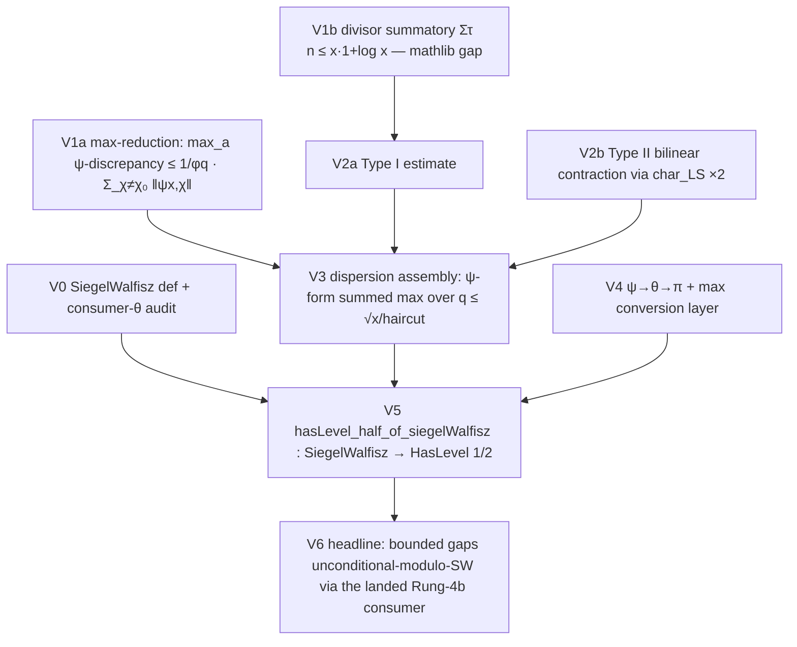

# The BV rung — Bombieri–Vinogradov modulo one named gate (`bv`)

*Fable, 2026-07-11. Ratified by the user (blueprint + execute). Recon:
`wf_11993b24-bdc` (three scouts; findings reproduced in
`project_largesieve` memory + below). Target: `HasLevel (1/2)` — the landed
Rung-4b level-of-distribution interface — CONDITIONAL on a single named
`SiegelWalfisz` hypothesis, hence*
**bounded prime gaps, unconditional modulo Siegel–Walfisz,**
*by instantiating the already-landed Maynard chain. Track branch `bv`.*

## Why this shape (the recon facts that constrain it)

1. **SW exists nowhere in Lean** (mathlib: qualitative `L ≠ 0` on `Re = 1`
   only — no zero-free regions, no Landau–Page, no Siegel; PNTA:
   zeta-only quantitative machinery, fixed-modulus qualitative PNT-in-AP).
   Proving SW is D-class/multi-quarter. It becomes THE named gate, exactly
   the `WindowPNT`/`PiAsymp`/`EHall` pattern — twice-proven this session.
2. **Precedent:** FLDutchmann/lean-bombieri-vinogradov derives BV from TWO
   axioms (SW + the large sieve), WIP ~40 sorries. We have PROVEN the
   large sieve (`Salt/LS/`) — one gate, zero axioms, and our derivation
   must land sorry-free per house rules.
3. **Consumer shape (verified by recon):** `HasLevel θ` (`Salt/Maynard/
   EHLevelTheta.lean`) is `∀ A > 0, ∃ B C ≥ 0, ∀ x ≥ 2,
   Σ_{q ≤ x^θ/(log x)^B} maxDiscrepancy x q ≤ C·x/(log x)^A` — the
   `∀A∃B` haircut order is BV's exact shape. BUT `maxDiscrepancy` is
   **π-form** (`primesCount`) and a **MAX** (`sup'` over reduced `a`),
   while ALL our carriers are ψ-form and BDH is a *variance* — BDH is a
   DECOY for this path. Two mandatory bridge layers: the max-reduction
   (V1) and the ψ→θ→π conversion (V4).

## Doctrine

Constant-factor / explicit-loose-numerals as in `largesieve.md`; every
`∃`-constant obtained before anything it is compared against; iron rules
per `CLAUDE.md`. Namespace `Salt.BV`, files `Salt/BV/*.lean`, aggregate
`Salt/BV/All.lean` wired into `Salt.lean` from the first code commit.
Carriers: REUSE `Salt.LS` (`psiChi`, `psiAP`, `psiTot`, `char_LS`,
`typeI_*`/`typeII_*`, `Conductor`, `PhiSum`) — no re-derivation.

## The named gate (Fable-frozen; V0 lands the def)

```lean
/-- Siegel–Walfisz: ψ(x; q, a) = x/φ(q) + O_A(x/(log x)^A) uniformly for
q ≤ (log x)^C. The single assumed analytic input of this rung (absent from
every Lean artifact as of 2026-07; supplied by future formalization or
upstream). ψ-form, in this repo's carriers. -/
def SiegelWalfisz : Prop :=
  ∀ A C : ℝ, 0 < A → 0 < C → ∃ K : ℝ, 0 ≤ K ∧ ∀ x q a : ℕ, 2 ≤ x →
    0 < q → ((q : ℝ) ≤ (Real.log x) ^ C) → Nat.Coprime a q →
    |psiAP x q a - (x : ℝ) / q.totient| ≤ K * x / (Real.log x) ^ A
```
(V0 executor latitude: exact inequality packaging/casts; the ∀A∀C∃K
order and the ψ-form are FROZEN. K is ineffective in the classical
proof — irrelevant here, it is top-level existential.)

## The node DAG



## Node catalog

Legend: class A–D per `CLAUDE.md`; statuses ⬜/🔄/✅/⛔.

### V0 — statements + consumer audit (Fable + one A/B node)
| id | content | class | status |
|---|---|---|---|
| V0.1 | `Salt/BV/Defs.lean`: the `SiegelWalfisz` def above + trivia (monotonicity in A; the `q ≤ (log x)^C` range is nonempty for large x) — def landed BYTE-EXACT; `siegelWalfisz_mono`/`psiAP_one`/`siegelWalfisz_psiTot` (q=1 = PNT-error, 3 ≤ x threshold)/`coprime_mod_left` (mathlib `ZMod.coprime_mod_iff_coprime`) | A/B | ✅ |
| V0.2 | **Consumer audit — RESOLVED by the blueprint verification pass (2026-07-11):** `Salt.Maynard.bounded_gaps_from_level : HasLevel (1/2) → ∃ C : ℕ, ∀ N, ∃ p q, N<p ∧ N<q ∧ p≠q ∧ p.Prime ∧ q.Prime ∧ (q:ℤ)-(p:ℤ) ∈ Set.Icc (-(C:ℤ)) (C:ℤ)` is landed sorry-free and consumes exactly `HasLevel (1/2)` (π-form, single-x `maxDiscrepancy`). V5's target stands; NO V5b needed; V6 is a one-line composition. | B (reading) | ✅ |

### V1 — the two independent B-preliminaries (parallel)
| id | content | class | status |
|---|---|---|---|
| V1a | **Max-reduction**: for `q ≥ 1`, reduced `a`: `|psiAP x q a − psiChi x χ₀/φ(q)| ≤ (1/φ(q))·Σ_{χ ≠ χ₀ mod q} ‖psiChi x χ‖` (from the orthogonality expansion `psiAP = (1/φq)Σ_χ χ̄(a)·psiChi x χ` — the L8.3 `psiChi_eq_sum_psiAP` machinery INVERTED; triangle inequality, `‖χ̄(a)‖ = 1`). Hence the max over `a` obeys the same bound (a-free RHS). File `Salt/BV/MaxReduction.lean`. — `psiAP_discrepancy_le` + `psiAP_discrepancy_sup'_le`; route improved: mathlib's `sum_char_inv_mul_char_eq` used directly (valid here — the argument is a unit), no hand-rolled conj bridge | B | ✅ |
| V1b | **Divisor summatory (mathlib gap)**: `Σ_{n ∈ Icc 1 x} (n.divisors.card : ℝ) ≤ x·(1 + Real.log x)` (swap `Σ_n Σ_{d∣n} 1 = Σ_d ⌊x/d⌋ ≤ x·Σ 1/d`, harmonic). Loose numeral fine. Plus the ℓ²-flavored corollary the Type II Cauchy–Schwarz wants: `Σ_{n≤x} (log n)² ≤ x(log x)²` (trivial) — put both in `Salt/BV/DivisorSum.lean`. — `sum_card_divisors_le` + `sum_log_sq_le`; the swap was pre-packaged in mathlib after all (`ArithmeticFunction.sum_Ioc_sigma0_eq_sum_div`) — only the ℝ-composition was the gap | B | ✅ |

### V2 — the Type I/II estimates (RE-DESIGNED, third-blocker fix 2026-07-11)

**⚠️ THIRD LEVEL-BREAKER (design-report gate):** `char_LS_max` is a
SINGLE-SEQUENCE maximal sieve; Type II is irreducibly BILINEAR. Monolithic
consumption gives `Σ‖c^{II}‖² ~ x·L⁵` (the `Στ²` mass — that candidate
node is a symptom of the failing route: DROPPED) times the `+13x` diagonal
⇒ un-saved `x·L⁶` for EVERY B. The budget closes only through a **maximal
BILINEAR large sieve** (new node V2.LS-bil). Type I via the plain sieve is
also un-saved; Fable ruling: **Pólya–Vinogradov route** (Route B) — PV is
within reach of the landed Gauss-sum toolkit (`dirichlet_inversion`,
`gaussSum_normSq`, `dist₁`, geometric `e`-sums), keeps the V1a
architecture uniform, and is a first-in-mathlib-world library theorem.
Verified budget (design report, Davenport/IK cross-checked): with these
nodes the total closes at `B(A) = A+5` (Davenport form) or `2A+8`
(thin-block form) — either satisfies V3.1's `∃B`.

| id | content | class | status |
|---|---|---|---|
| V2.PV | **Pólya–Vinogradov**: `max_{t ≤ ?}‖Σ_{m≤t} χ(m)‖ ≤ √f·(1 + log f)`-shape for non-principal χ mod f. Route: `dirichlet_inversion` (χ from additive chars) + `gaussSum_normSq` (`‖τ‖=√f`) + geometric sums `‖Σ_{m≤t} e(am/f)‖ ≤ min(t, 1/(2·dist₁(a/f, 0)))` + `Σ_a 1/dist₁ ~ f log f`. All ingredients LANDED. — **`polya_vinogradov`** + `polya_vinogradov_sup'`, `Salt/BV/PolyaVinogradov.lean` (334 lines; chord via mathlib `Real.mul_abs_le_abs_sin` Jordan + `Complex.norm_exp_I_mul_ofReal_sub_one`; exact target constant, PB-floor unused). FIRST PV in any proof assistant. | C | ✅ |
| V2a | **Type I via PV, FROZEN (5th level-breaker fixed at freeze):** TWO bounds — the original single `U·Q^{3/2}` formula conflated the masses (TypeI₂'s outer support is `UV`, giving `x^{23/20}` at `x^{1/5}`: FALSE). At **`U = V = x^{1/10}`** (documented V3.1 latitude; window `θ ∈ (0,1/8)`, wall at 1/8): `typeI_one_maxdisc_le`: `Σ_{(logx)^C<f≤Q}(1/φf)Σ*_χ max_y‖TypeI₁‖ ≤ C₁·U·Q^{3/2}·L²` (mass `U`, Abel for the log weight) = `x^{17/20}L²` ✓; `typeI_two_maxdisc_le`: same LHS, TypeI₂ `≤ C₂·U·V·Q^{3/2}·L²` (mass `UV`, plain PV) = `x^{19/20}L²` ✓. All inputs landed (PV `_sup'` t-uniform, typeI shapes, `Σ√f ≤ Q^{3/2}`). V2b re-checked at `x^{1/10}`: boundary terms rise to `x^{19/20}` — still power-saving; Tₐ/diagonal U,V-independent. | C | ⬜ |
| V2.LS-bil | **The maximal BILINEAR large sieve** (THE rung cost center). STATEMENT (survives the adversarial pass; L¹-with-max-inside is FORCED by the toolkit — the L² bilinear form is unreachable): `Σ_{q≤Q}(q/φq)Σ*_χ max_{y≤MN} ‖Σ_{m<M}Σ_{n<N, mn≤y} aₘbₙχ(mn)‖ ≤ c·((M:ℝ)+Q²)^{1/2}((N:ℝ)+Q²)^{1/2}‖a‖₂‖b‖₂·(polylog MN)^κ`, FREE Q (V2b calls it per conductor block at `Q := 2F`). **MECHANISM RE-ROUTED (4th level-breaker, adversarial pass 2026-07-11):** the thin-block sketch pays `√(#blocks) = √(M/Q²·logM)` — a POWER loss (CS-over-blocks puts √K on the a-side; the R_i are NESTED prefixes, not disjoint — the draft's "R-side only" claim was FALSE), and the boundary strip's δ-gain is unrecoverable under `max_y` (moving window = difference of prefixes, each at FULL b-energy). Honest route: (i) outer dyadic-in-y reduction (`char_LS_max`'s own mechanism: `max_y` → ~log fixed shells at √log cost); (ii) per fixed shell `Y`, complete the sharp cutoff `1_{mn≤Y}` via a Perron/finite-completion kernel into polylog smooth product-twists (NEW prerequisite node V2.Perron); (iii) the clean product large sieve (CS-in-χ, `char_LS` per factor). | C+/D→C+ | ⬜ (statement frozen; mechanism = recon's L1–L4: `interval_decomp` max→shells (L¹ form, factor `1+log₂MN` — NOT the squared char_LS_max form), per-shell P2 factorization, CS-in-(q,χ) + `char_LS`×2 per h, `Σ_h γ_h ≤ 2+logH` collapse ⇒ **κ = 2**, `B(A) = A+2`) |
| V2.Perron | **Cutoff completion — FROZEN Route S** (recon 2026-07-11: the elementary finite-Fourier completion is an EXACT identity, zero error term; it is the PV kernel's second harvest — `geom_e_bound`/`sum_H_le`/`dist_lb` reuse verbatim; Route P/truncated-Perron would be C+/D and the PNTA dep is DECLINED — v4.31 skew, reserved for SW). Sub-DAG: P1 additive orthogonality (mathlib `AddChar.sum_eq_zero_of_ne_one`, A/B); **P2 interval-indicator DFT** — for `n ∈ [1,H]`: `1_{n≤Z} = Σ_{h<H} ĉ_h(Z)·e(hn/H)`, `ĉ_h(Z) = (1/H)Σ_{k≤Z} e(−hk/H)` (the one new C piece; take `H = N`, `Z_m = min(⌊Y/m⌋, N)`; the range/period bookkeeping is the real work); P3 L¹ mass `Σ_h|ĉ_h| ≤ 2 + log H` uniform in Z (from `geom_e_bound` + `sum_H_le`, A/B); P4 per-coeff m-uniform bound = `geom_e_bound` verbatim (A). Class C total, ~150–250 lines. | C | ⬜ |
| V2b | **Type II** `typeII_maxdisc_le` (CORRECTED per the pass): `Σ_{f > (log x)^C ≤ Q}(1/φf)Σ*_χ max_y‖TypeII(y,χ)‖ ≤ C·(x^{1/2}·Q + x·U^{-1/2} + x·V^{-1/2})·L^κ` — the two Vaughan-range boundary terms are GENUINE (the pure `x^{1/2}Q` form is FALSE as a free-Q lemma; fine at the operating point); the LOWER conductor cutoff `f > (log x)^C` is REQUIRED (the conductor-1 block has no cancellation — un-saved `x·L`; small conductors are V3.2/SW's). Instantiate V2.LS-bil at `a = μ` (d~D), `b = typeIIData V`, `(1/φf) ≤ (1/F)(f/φf)` per conductor block (NOT the naive `≤ f/φf` — a factor-Q catastrophe), `Q := 2F`. Budget re-verified: closes at `B ≥ A+κ`, with `C ≥ B+1−κ`. | C+ | ⬜ |
| V2.SW-maxy | tiny: `sup_{2≤y≤x} y/(log y)^{A'} ≤ C_{A'} + x/(log x)^{A'}` (the max-y lift for the SW piece — the function is eventually increasing) — `sup_div_log_pow_le`, `Salt/BV/SWMaxY.lean`, explicit `C = exp(A)/(log 2)^A`, full calculus route (`monotoneOn_of_hasDerivWithinAt_nonneg` on `Ici (exp A)`) | A/B | ✅ |

The L¹/L² CS bridge (verified): `Σ_f(1/φf)Σ*_χ M_χ ≤ √(Σ_f(f/φf)Σ*_χ M_χ²)·√(1+log Q)` — V3.1's glue **for SINGLE-CHARACTER pieces only** (Type I via PV, small-conductor SW). Type II reaches its `(1/φf)`-weight via the per-conductor-block division of the L¹ bilinear output — NOT via this bridge (the L² bilinear form is unreachable by the toolkit). V3.1 splits ψ = TypeI + TypeII at the L¹ level.
`char_LS_max` remains landed/reusable (single-sequence prefixes, PV's partial summation) — just not the Type II engine.
### V3 — dispersion assembly (ψ-form MAXIMAL BV)
| id | content | class | status |
|---|---|---|---|
| V3.0 | **Maximal completion (BLOCKER fix — new node):** the mechanism threading `max_{y ≤ x}` through the chain. Route (Fable-preferred): dyadic-in-`y` decomposition — `max_{y≤x} |Σ_{n≤y} aₙ| ≤ Σ_{levels ℓ ≤ log₂x} (block maxima)`, costing one `log x` factor, lifting the fixed-x `char_LS` applications to maximal form; alternatively thread the `y`-cutoff through the Vaughan pieces directly (Davenport's route). Deliverable: the reusable lemma the V2 nodes cite. — **`char_LS_max`**, `Salt/BV/MaxLS.lean` (~345 lines): sup' over `Icc 0 N`, sharp `(1+logb 2 N)²` factor; the load-bearing `interval_decomp` (strict-length dyadic induction, ≤1 block/level) + `blockCoeff`/`sum_blockCoeff_normSq` reusable pieces | C | ✅ |
| V3.2 | **AP-form SW → character form at small conductor (correction fix — new node):** for non-principal primitive `χ⋆` mod `f ≤ (log x)^C`: `‖psiChi y χ⋆‖ ≤ φ(f)·K·y/(log y)^A` from `SiegelWalfisz` via the landed `psiChi_eq_sum_psiAP` + `Σ_a χ⋆(a) = 0` (the `x/φf` mean enters free); the `φf ≤ (logx)^C` factor absorbed by `A ↦ A + C`. Also the mean-reconciliation trivia: SW's `x/φq` ↔ `psiChi x χ₀/φq` via SW at `q = 1` (PNT-error) + the ω(q)·log x prime-power fibers (`Conductor.lean`); budget `Σ_{q≤Q} ω(q) log x = o(x)`. — `sum_dirichletCharacter_eq_zero` (mathlib `MulChar.sum_eq_zero_of_ne_one`) + `psiChi_le_of_siegelWalfisz` (+`_absorbed`, A↦A−C) + `norm_psiChi_one_sub_psiTot_le`, `Salt/BV/SWChar.lean`, ALL 4 deliverables | B | ✅ |
| V3.1 | **ψ-form maximal BV** (RE-FROZEN with the y-sup): `SiegelWalfisz → ∀ A > 0, ∃ B C, ∀ x ≥ 2, Σ_{q ≤ ⌊√x/(log x)^B⌋} max_{y ≤ x} maxAP-discrepancy(y, q) ≤ C·x/(log x)^A` — combining V1a (per-y) + V3.0 + conductor descent + V3.2 (small conductors) + V2a/V2b dyadic (large conductors) + the Vaughan head. Vaughan parameters **`U = V = x^{1/10}`** (fixed by the V2a freeze — the `x^{1/5}` original breaks TypeI₂; window `θ ∈ (0,1/8)`). THE keystone assembly. | C+ | ⬜ |
### V4 — the consumer bridge (ψ → π, max forms)
| id | content | class | status |
|---|---|---|---|
| V4.1 | ψ→θ: drop prime powers (`≤ 2√x·(log x)²`-crude per modulus, summed ≤ budget via the q-count) | B | ⬜ |
| V4.2 | θ→π: partial summation `π(x;q,a) − π-main = [θ-discrepancy at x]/log x + ∫₂ˣ [θ-discrepancy at t]/(t log²t) dt` — **REQUIRES V3.1's `max_{y≤x}` form** (adversarial pass: the ∫ needs the discrepancy at ALL scales; `∫₂ˣ dt/(t log²t) ≤ 1/log 2` then closes it; the 'cruder sandwich' idea is FALSE — it destroys the main-term cancellation). Plus the `maxDiscrepancy` (sup')-packaging over reduced residues. `Salt/BV/PsiToPi.lean`. | C | ⬜ |

### V5 — the target
| id | content | class | status |
|---|---|---|---|
| V5.1 | **`hasLevel_half_of_siegelWalfisz : SiegelWalfisz → HasLevel (1/2)`** (or the exact consumer form per V0.2's audit; statement FROZEN after V0.2 reports — Fable sign-off required) | C | ⬜ |

### V6 — the headline
| id | content | class | status |
|---|---|---|---|
| V6.1 | Compose with the landed Maynard chain (per V0.2's audit): **`bounded_gaps_of_siegelWalfisz : SiegelWalfisz → ∀ N, ∃ p q, N < p ∧ N < q ∧ p ≠ q ∧ p.Prime ∧ q.Prime ∧ |gap| ≤ C₀`** for the landed explicit C₀ (whatever diameter the Rung-3/4b chain yields at level 1/2 — NOT 600; the k=105 certificate is a future rung). Ideally a short composition. | B/C | ⬜ |

## PB-floors
- V3.1 is the rung's MUST; its floor is the statement with V2a/V2b outputs
  as explicit hypotheses if their frozen forms prove mis-shaped (Fable
  re-freeze, one round).
- V5.1/V6.1 floors: land at whatever θ/form V0.2's audit shows is
  consumable; if the consumer genuinely needs `EH θ` Prop-shape, add the
  `HasLevel → EH`-bridge as V5b and flag.
- The rung is DONE at V6.1; BDH-sharpening (`Qx·logx`, needs SW anyway)
  and the k=105 certificate are explicitly OUT (future rungs).

## Statement-design decisions reserved to Fable
`SiegelWalfisz` final packaging (V0.1 review); V2a/V2b frozen output
shapes (at V2 dispatch, after V1 lands); V5.1's exact statement (after
V0.2); any change to the landed `Salt/LS`/`Salt/Maynard` interfaces
(NONE expected — consumption only).
